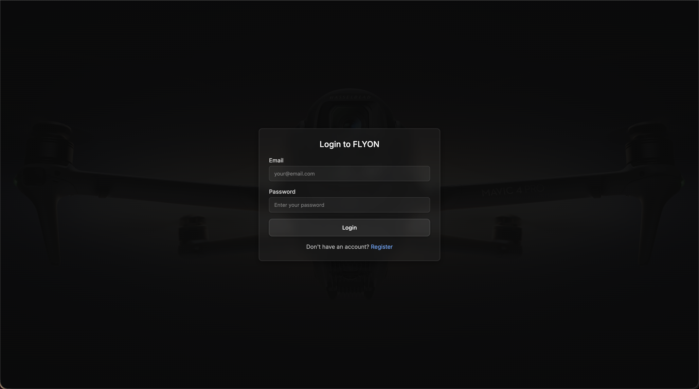
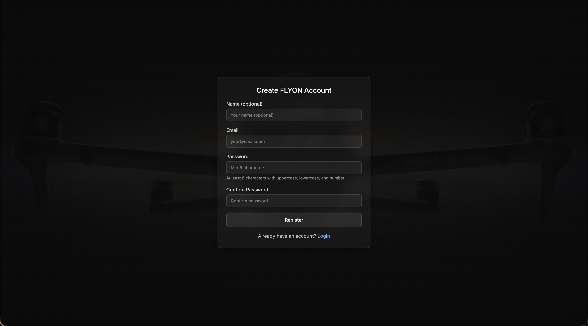
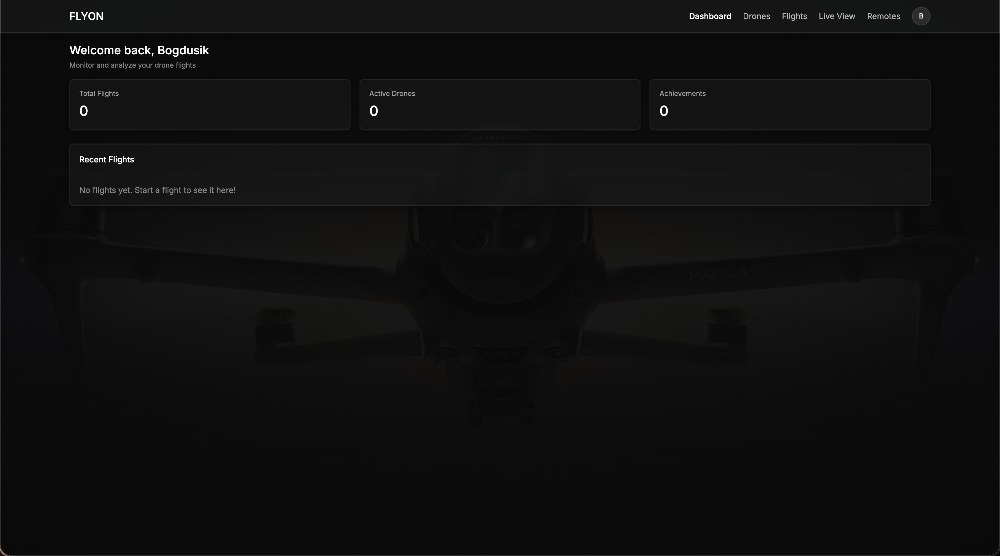
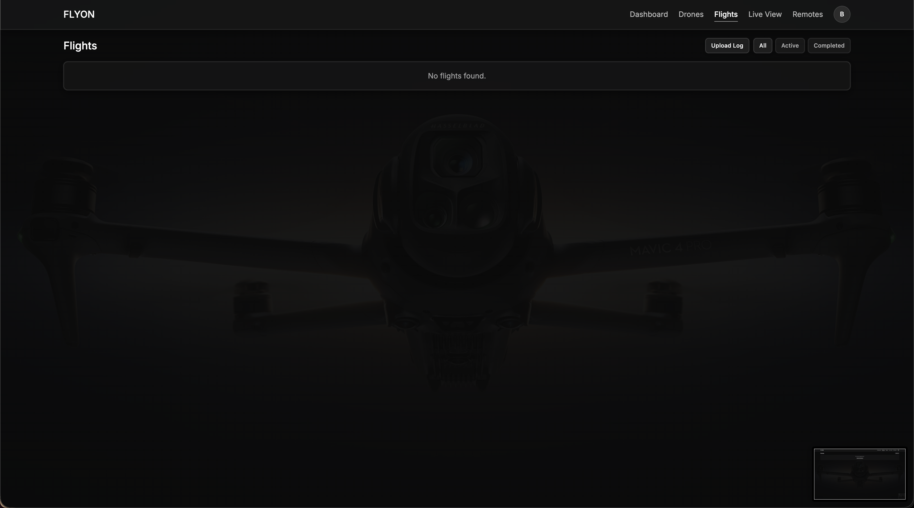
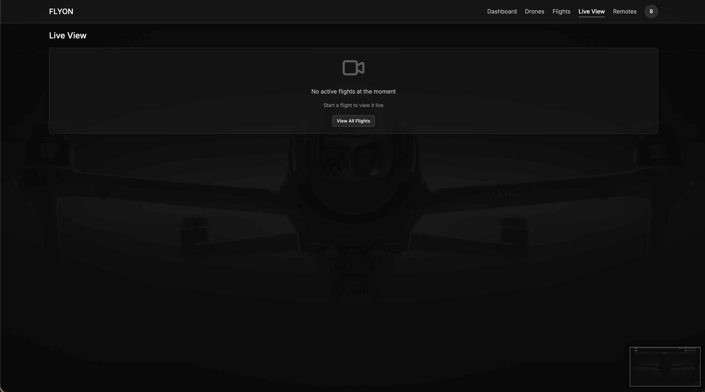
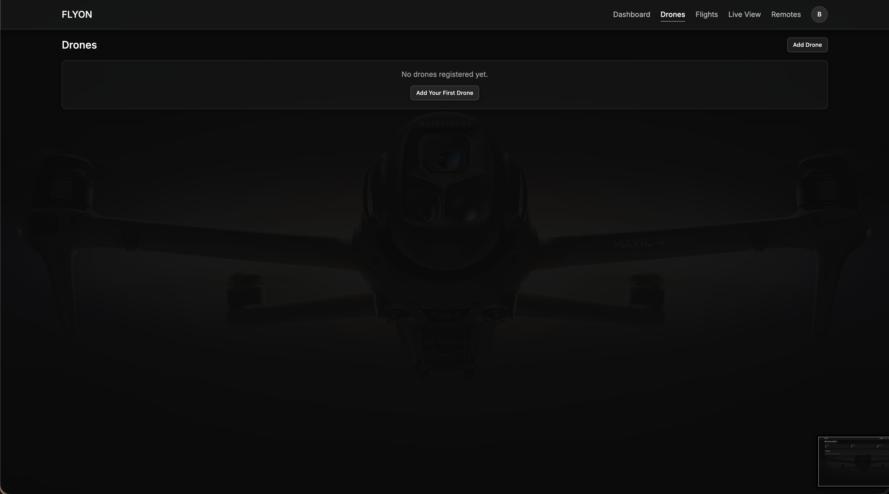
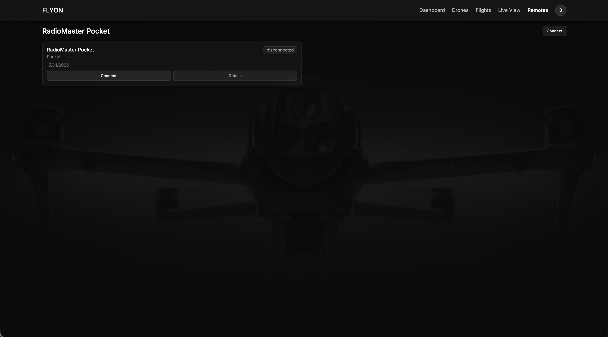

# FLYON - Drone Flight Analytics Platform

FLYON is a personal web platform for drone and FPV drone owners. It helps users understand, analyze, and improve their flights through telemetry, real-time tracking, safety warnings, and post-flight insights.

## Architecture

- **Frontend**: Next.js 14+ (React, TypeScript, Tailwind CSS)
- **Backend**: Node.js + Express (TypeScript)
- **Database**: PostgreSQL with PostGIS extension
- **Real-time**: WebSocket for live telemetry updates
- **Authentication**: JWT-based with device tokens

## Project Structure

```
FLYON/
├── backend/          # Node.js/Express API server
├── frontend/         # Next.js application
├── tools/            # Ground bridge and utilities
├── docs/             # Project documentation
├── scripts/          # Helper scripts
├── docker-compose.yml # Development environment
└── README.md
```

## Features

### Core Features
- User authentication and profile management
- Drone management with device tokens
- Real-time flight tracking with live map
- Telemetry ingestion (log upload, live bridge, RadioMaster Pocket)
- Danger zone warnings and safety assistant
- Post-flight analysis and Flight Health Score
- Flight replay with timeline visualization
- Analytics dashboard and flight history
- GDPR-compliant data export and deletion

### Advanced Features
- **Betaflight Integration** - Config management, PID tuning, Blackbox analysis
- **Advanced Analytics** - G-force analysis, maneuver detection, flight comparison
- **Social Features** - Flight sharing, achievements, public profiles
- **RadioMaster Pocket** - USB Serial integration for transmitter data
- **Weather API** - Flight condition monitoring (ready for integration)

**See [docs/FEATURES.md](./docs/FEATURES.md) for complete feature list.**

## Screenshots

<div align="center">

### Login & Registration



### Dashboard


### Flights Management



### Drone & Remote Management



</div>

## Getting Started

### Prerequisites

- **Node.js 18+** installed
- **Docker Desktop** installed and running
- **npm** or **yarn** package manager

### Quick Start

**For complete setup guide, see [docs/GETTING_STARTED.md](./docs/GETTING_STARTED.md)**

**Quick commands:**

1. Start database: `docker-compose up -d`
2. Setup backend: `cd backend && npm install && npm run migrate`
3. Setup frontend: `cd frontend && npm install`
4. Start backend: `cd backend && npm run dev` (Terminal 1)
5. Start frontend: `cd frontend && npm run dev` (Terminal 2)
6. Open: http://localhost:3000

**Note:** Make sure to create `.env` file in `backend/` and `.env.local` in `frontend/` directories. See [docs/GETTING_STARTED.md](./docs/GETTING_STARTED.md) for configuration details.

**Quick scripts:** Use `./scripts/start-all.sh` to start everything automatically.

**Documentation:** See [docs/README.md](./docs/README.md) for complete documentation index.

### Database Migrations

Run migrations to set up the database schema:
```bash
cd backend
npm run migrate
```

### Telemetry Input Methods

FLYON supports multiple telemetry input methods:

1. **Log Upload** - CSV, JSON files via web interface
2. **Live Bridge** - MAVLink → FLYON via ground bridge
3. **RadioMaster Pocket** - USB Serial connection for transmitter data
4. **Betaflight Blackbox** - Upload and analyze .bbl logs
5. **Companion Computer** - Onboard telemetry (future)

### API Endpoints

- `POST /api/v1/auth/register` - Register new user
- `POST /api/v1/auth/login` - Login and get JWT token
- `GET /api/v1/auth/me` - Get current user profile
- `GET /api/v1/drones` - List user's drones
- `POST /api/v1/drones` - Create new drone
- `GET /api/v1/flights` - List user's flights
- `POST /api/v1/flights` - Create new flight session
- `POST /api/v1/telemetry` - Ingest telemetry (requires device token)
- `POST /api/v1/flights/upload-log` - Upload flight log file (CSV, JSON)
- `GET /api/v1/danger-zones` - List danger zones
- `POST /api/v1/analytics/flights/:id/health-score` - Calculate health score
- `GET /api/v1/export/data` - Export all user data (GDPR)
- `GET /api/v1/export/flights/:id/kml` - Export flight to KML format
- `GET /api/v1/export/flights/:id/gpx` - Export flight to GPX format

### WebSocket Events

Connect to `ws://localhost:3002?token=<JWT_TOKEN>`

- `subscribe` - Subscribe to flight updates: `{ type: 'subscribe', flight_id: '...' }`
- `telemetry` - Receive telemetry updates: `{ type: 'telemetry', flight_id: '...', data: {...} }`
- `warning` - Receive danger zone warnings: `{ type: 'warning', data: {...} }`
- `flight_update` - Receive flight status updates: `{ type: 'flight_update', flight_id: '...', data: {...} }`

## Performance & Real-Time Updates

FLYON is optimized for smooth real-time updates with minimal system load:

- **Memory Management**: Automatic telemetry array limiting (max 10,000 points)
- **WebSocket Optimization**: Primary real-time channel with intelligent fallback
- **Component Memoization**: Reduced recalculations by 70-80%
- **Map Debouncing**: Smooth 60 FPS map updates with <100ms latency
- **Graph Optimization**: Efficient rendering even with 10,000+ telemetry points

For detailed performance optimizations, see [docs/PERFORMANCE_OPTIMIZATIONS.md](./docs/PERFORMANCE_OPTIMIZATIONS.md)

## System Principles

- **Safety Assistant, Not Autopilot**: FLYON provides warnings and insights only
- **Privacy-First**: User owns all data, GDPR-compliant
- **Drone-Agnostic**: Works with any drone via telemetry input
- **Production-Ready**: Clean architecture, scalable design
- **Performance-Optimized**: Smooth real-time updates with minimal resource usage

## License

MIT
